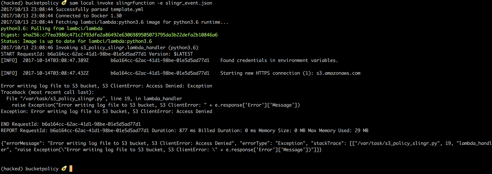

# HACKRU challenge
Best pull request for a feature or experiment (deadline is Sunday) 

Some initial ideas can be found @ https://github.com/Optum/ChaoSlingr/projects/1 or look for branches prefixed with hackru_ we will be hacking our own project this weekend

Questions: come to our booth or ask questions @ https://chaoslingr.slack.com

# How to begin
You will need docker, node, and python installed on your workstation 
1. `git clone -b hackRU https://github.com/Optum/ChaoSlingr.git`
2. `virtualenv hacked`
3. `source hacked/bin/activate`
4. `pip install localstack`
5. `npm install -g aws-sam-local`
6. `localstack start` or if you want to run in background `localstack start &`
7. `aws --endpoint-url=http://localhost:4572 s3api create-bucket --bucket test-bucket --region us-east-1` (you just made your first AWS call!)
8. `cd ChaoSlingr/test/bucketpolicy/`
9. `sam local invoke slingrFunction -e slingr_event.json` 

Cool you just ran your first experiment. What should of happened is output like this

# If you found AWS Credit begin by
Find some AWS credit and make your own account to move from local env to public cloud. 

### Using SAM
1. `git clone -b hackru https://github.com/Optum/ChaoSlingr.git`
2. `npm install -g aws-sam-local`
3. `cd src/lambda/bucketpolicy`
4. `sam deploy --template-file ./packaged.yaml --stack-name chaostest --capabilities CAPABILITY_IAM`

# ChaoSlingr: Introducing Security into Chaos Testing
ChaoSlingr is a Security Chaos Engineering Tool focused primarily on the experimentation on AWS Infrastructure to bring system security weaknesses to the forefront.

Join the community - https://chaoslingr.slack.com
